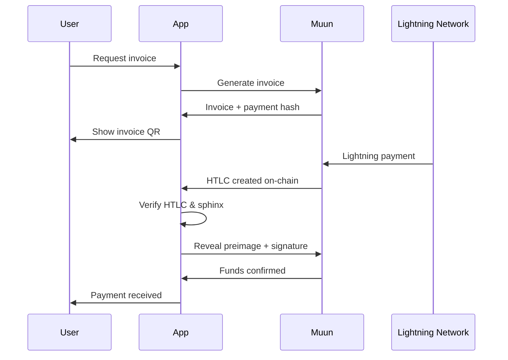
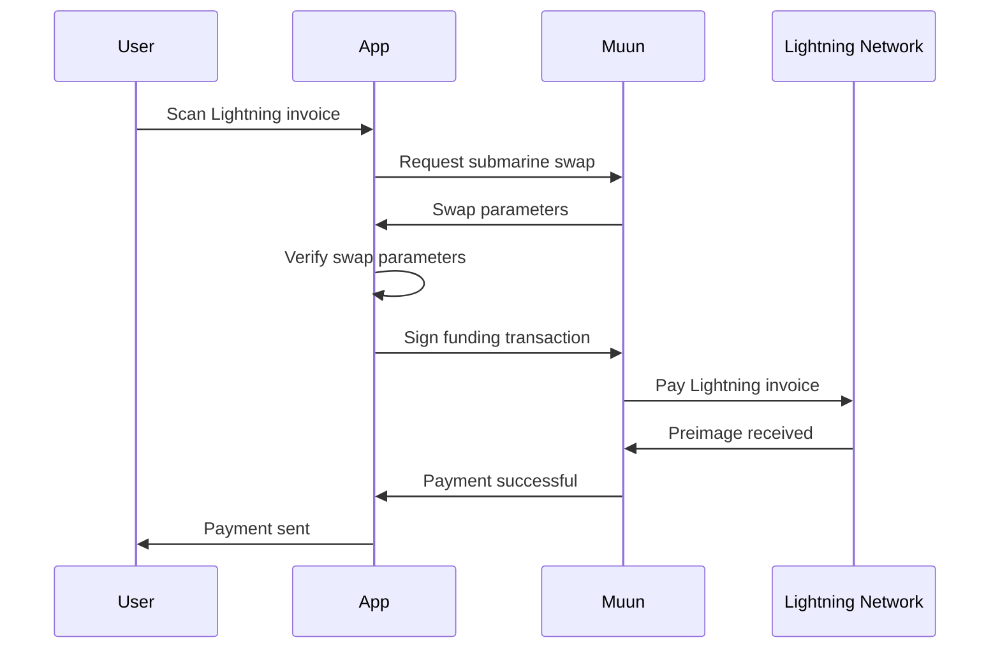

## Overview

Muun provides **seamless Lightning Network** functionality without requiring users to manage channels, liquidity, or understand Lightning's technical complexity. Users can send and receive Lightning payments as easily as on-chain transactions.

<Info>
Muun's Lightning integration uses **submarine swaps** to convert between on-chain and Lightning funds atomically, eliminating the need for users to manage channels.
</Info>

## Architecture

Muun's Lightning implementation consists of:

<CardGroup cols={2}>
  <Card title="Invoice Generation" icon="receipt">
    Creating Lightning invoices for receiving payments
  </Card>
  <Card title="Submarine Swaps" icon="arrows-rotate">
    Converting on-chain funds to Lightning for sending
  </Card>
  <Card title="Incoming Swaps" icon="arrow-down">
    Receiving Lightning payments to on-chain balance
  </Card>
  <Card title="HTLC Verification" icon="shield-check">
    Cryptographic validation of payment atomicity
  </Card>
</CardGroup>

## Receiving Lightning Payments

### Invoice Creation

When a user wants to receive Lightning payment, Muun generates an invoice:

```swift
// Source: falcon/app/falcon/core/Domain/Model/IncomingSwap/IncomingSwap.swift:9-27
public class IncomingSwap {
    let uuid: String
    public let paymentHash: Data
    let htlc: IncomingSwapHtlc?
    let sphinxPacket: Data?
    let collect: Satoshis
    let paymentAmountInSats: Satoshis
    public private(set) var preimage: Data?
    
    public init(uuid: String, paymentHash: Data, htlc: IncomingSwapHtlc?, 
                sphinxPacket: Data?, collect: Satoshis, 
                paymentAmountInSats: Satoshis, preimage: Data?) {
        self.uuid = uuid
        self.paymentHash = paymentHash
        self.htlc = htlc
        self.sphinxPacket = sphinxPacket
        self.collect = collect
        self.paymentAmountInSats = paymentAmountInSats
        self.preimage = preimage
    }
}
```

### HTLC Structure

Incoming Lightning payments are secured using **Hash Time-Locked Contracts (HTLCs)**:

```swift
// Source: falcon/app/falcon/core/Domain/Model/IncomingSwap/IncomingSwap.swift:69-88
public struct IncomingSwapHtlc {
    let uuid: String
    let expirationHeight: Int64
    let fulfillmentFeeSubsidyInSats: Satoshis
    let lentInSats: Satoshis
    let address: String
    let outputAmountInSatoshis: Satoshis
    let swapServerPublicKey: Data
    let htlcTx: Data
    // Present only if the swap is fulfilled
    let fulfillmentTx: Data?
}
```

### Fulfillment Process

1. **Sender routes payment** through Lightning Network
2. **Muun swap server receives** Lightning payment
3. **HTLC created** on-chain, locked with payment hash
4. **Client verifies** HTLC and sphinx packet
5. **Client reveals preimage** to claim funds
6. **Funds added** to user's on-chain balance

```go
// Source: libwallet/incoming_swap.go:62-115
func (s *IncomingSwap) VerifyFulfillable(userKey *HDPrivateKey, net *Network) error {
    paymentHash := s.PaymentHash
    
    if len(paymentHash) != 32 {
        return fmt.Errorf("VerifyFulfillable: received invalid hash len %v", 
            len(paymentHash))
    }
    
    // Lookup invoice data matching this HTLC using the payment hash
    invoice, err := s.getInvoice()
    if err != nil {
        return fmt.Errorf("VerifyFulfillable: could not find invoice data: %w", err)
    }
    
    // Derive identity key for sphinx validation
    parentPath, err := hdpath.Parse(invoice.KeyPath)
    if err != nil {
        return fmt.Errorf("VerifyFulfillable: invalid key path: %v", invoice.KeyPath)
    }
    identityKeyPath := parentPath.Child(identityKeyChildIndex)
    
    nodeHDKey, err := userKey.DeriveTo(identityKeyPath.String())
    if err != nil {
        return fmt.Errorf("VerifyFulfillable: failed to derive key: %w", err)
    }
    nodeKey, err := nodeHDKey.key.ECPrivKey()
    if err != nil {
        return fmt.Errorf("VerifyFulfillable: failed to get priv key: %w", err)
    }
    
    // Verify payment amount matches invoice
    if invoice.AmountSat != 0 && invoice.AmountSat > s.PaymentAmountSat {
        return fmt.Errorf("VerifyFulfillable: payment amount mismatch")
    }
    
    if len(s.SphinxPacket) == 0 {
        return nil
    }
    
    // Validate sphinx packet cryptographically
    err = sphinx.Validate(
        s.SphinxPacket,
        paymentHash,
        invoice.PaymentSecret,
        nodeKey,
        0,
        lnwire.MilliSatoshi(uint64(s.PaymentAmountSat)*1000),
        net.network,
    )
    if err != nil {
        return fmt.Errorf("VerifyFulfillable: invalid sphinx: %w", err)
    }
    
    return nil
}
```

<Warning>
**Critical Security Check**: The client must verify the sphinx packet and payment amount before revealing the preimage. Revealing the preimage without verification could result in loss of funds.
</Warning>

### HTLC Script

The HTLC script enforces atomic swap conditions:

```go
// Source: libwallet/incoming_swap.go:478-501
func createHtlcScript(userPublicKey, muunPublicKey, swapServerPublicKey []byte, 
                      expiry int64, paymentHash []byte) ([]byte, error) {
    sb := txscript.NewScriptBuilder()
    sb.AddData(muunPublicKey)
    sb.AddOp(txscript.OP_CHECKSIG)
    sb.AddOp(txscript.OP_NOTIF)
        sb.AddOp(txscript.OP_DUP)
        sb.AddOp(txscript.OP_HASH160)
        sb.AddData(btcutil.Hash160(swapServerPublicKey))
        sb.AddOp(txscript.OP_EQUALVERIFY)
        sb.AddOp(txscript.OP_CHECKSIGVERIFY)
        sb.AddInt64(expiry)
        sb.AddOp(txscript.OP_CHECKLOCKTIMEVERIFY)
    sb.AddOp(txscript.OP_ELSE)
        sb.AddData(userPublicKey)
        sb.AddOp(txscript.OP_CHECKSIGVERIFY)
        sb.AddOp(txscript.OP_SIZE)
        sb.AddInt64(32)
        sb.AddOp(txscript.OP_EQUALVERIFY)
        sb.AddOp(txscript.OP_HASH160)
        sb.AddData(ripemd160(paymentHash))
        sb.AddOp(txscript.OP_EQUAL)
    sb.AddOp(txscript.OP_ENDIF)
    return sb.Script()
}
```

This script allows spending via two paths:

1. **Success path**: User + Muun sign + reveal preimage
2. **Refund path**: Swap server can refund after expiry

## Sending Lightning Payments

### Submarine Swap Process

To send Lightning payment, Muun uses **submarine swaps**:

```swift
// Source: falcon/app/falcon/core/Domain/Model/Operations/SubmarineSwap.swift:12-56
public class SubmarineSwap: NSObject {
    let _swapUuid: String
    public let _invoice: String
    public let _receiver: SubmarineSwapReceiver
    public let _fundingOutput: SubmarineSwapFundingOutput
    public let _fees: SubmarineSwapFees?
    let _expiresAt: Date
    public let _willPreOpenChannel: Bool
    public let _bestRouteFees: [BestRouteFees]?
    public let _fundingOutputPolicies: FundingOutputPolicies?
    let _payedAt: Date?
    public let _preimageInHex: String?
    
    init(swapUuid: String,
         invoice: String,
         receiver: SubmarineSwapReceiver,
         fundingOutput: SubmarineSwapFundingOutput,
         fees: SubmarineSwapFees?,
         expiresAt: Date,
         willPreOpenChannel: Bool,
         bestRouteFees: [BestRouteFees]?,
         fundingOutputPolicies: FundingOutputPolicies?,
         payedAt: Date?,
         preimageInHex: String?) {
        _swapUuid = swapUuid
        _invoice = invoice
        _receiver = receiver
        _fundingOutput = fundingOutput
        _fees = fees
        _expiresAt = expiresAt
        _willPreOpenChannel = willPreOpenChannel
        _bestRouteFees = bestRouteFees
        _fundingOutputPolicies = fundingOutputPolicies
        _payedAt = payedAt
        _preimageInHex = preimageInHex
    }
}
```

### Swap Funding Output

The submarine swap creates a special output that can be spent in two ways:

```swift
// Source: falcon/app/falcon/core/Domain/Model/Operations/SubmarineSwap.swift:134-183
public class SubmarineSwapFundingOutput: NSObject {
    public let _outputAddress: String
    let _outputAmount: Satoshis?
    public let _confirmationsNeeded: Int?
    let _userLockTime: Int?
    let _serverPaymentHashInHex: String
    let _serverPublicKeyInHex: String
    let _expirationInBlocks: Int?
    let _scriptVersion: Int
    
    // v1 only
    let _userRefundAddress: MuunAddress?
    
    // v2 only
    let _userPublicKey: WalletPublicKey?
    let _muunPublicKey: WalletPublicKey?
    
    public let _debtType: DebtType?
    public let _debtAmount: Satoshis?
}
```

### Fee Calculation

Lightning fees include multiple components:

```swift
// Source: falcon/app/falcon/core/Domain/Model/Operations/SubmarineSwap.swift:57-76
public func getLightningFeeInSats(onChainFee: BitcoinAmount) -> Satoshis? {
    // If the invoice didn't have an amount, fee info might not be available
    guard let debtType = _fundingOutput._debtType,
          let fees = _fees else {
        return nil
    }
    
    if debtType == .LEND {
        // For lend swaps: Only the routing fee
        return fees._lightning
    }
    
    // For 0-conf, 1-conf and top-ups: 
    // routing fee + on-chain fee + sweep fee
    return fees._lightning + onChainFee.inSatoshis + fees._sweep
}
```

```swift
// Source: falcon/app/falcon/core/Domain/Model/Operations/SubmarineSwap.swift:102-118
public class SubmarineSwapFees: NSObject {
    public let _lightning: Satoshis      // Lightning routing fee
    public let _sweep: Satoshis          // Sweep to Lightning
    public let _channelOpen: Satoshis    // Channel opening (if needed)
    public let _channelClose: Satoshis   // Channel closing (if needed)
    
    init(lightning: Satoshis, sweep: Satoshis, 
         channelOpen: Satoshis, channelClose: Satoshis) {
        _lightning = lightning
        _sweep = sweep
        _channelOpen = channelOpen
        _channelClose = channelClose
    }
    
    public func total() -> Satoshis {
        return _lightning + _sweep + _channelOpen + _channelClose
    }
}
```

## Swap Validation

Before executing a submarine swap, the client validates all parameters:

```go
// Source: libwallet/swaps/swaps.go:79-96
func (swap *SubmarineSwap) Validate(
    rawInvoice string,
    userPublicKey *KeyDescriptor,
    muunPublicKey *KeyDescriptor,
    originalExpirationInBlocks int64,
    network *chaincfg.Params,
) error {
    
    version := swap.FundingOutput.ScriptVersion
    switch version {
    case addresses.SubmarineSwapV1:
        return swap.validateV1(rawInvoice, userPublicKey, 
            muunPublicKey, network)
    case addresses.SubmarineSwapV2:
        return swap.validateV2(rawInvoice, userPublicKey, 
            muunPublicKey, originalExpirationInBlocks, network)
    default:
        return fmt.Errorf("unknown swap version %v", version)
    }
}
```

## Debt Management

Muun can **lend** users funds for Lightning payments, creating a debt that's collected later:

```swift
// Source: falcon/app/falcon/core/Domain/Model/Operations/SubmarineSwap.swift:279-302
public class SwapExecutionParameters: NSObject {
    public let sweepFee: Satoshis
    public let routingFee: Satoshis
    public let debtType: DebtType
    public let debtAmount: Satoshis
    public let confirmationsNeeded: UInt
    
    public init(sweepFee: Satoshis,
                routingFee: Satoshis,
                debtType: DebtType,
                debtAmount: Satoshis,
                confirmationsNeeded: UInt) {
        self.sweepFee = sweepFee
        self.routingFee = routingFee
        self.debtType = debtType
        self.debtAmount = debtAmount
        self.confirmationsNeeded = confirmationsNeeded
    }
    
    public var offchainFee: Satoshis {
        return routingFee + sweepFee
    }
}
```

<Info>
**Debt Types:**
- `LEND`: Muun lends funds, collected from future incoming payments
- `COLLECT`: User has existing debt being collected
- `NONE`: No debt involved
</Info>

## Payment Flow Diagrams

### Receiving Lightning Payment



### Sending Lightning Payment



## Security Considerations

<CardGroup cols={2}>
  <Card title="Atomic Swaps" icon="atom">
    HTLCs ensure payments are atomic - either fully complete or fully refund
  </Card>
  <Card title="Sphinx Validation" icon="shield">
    Cryptographic proof that payment is legitimate and for correct amount
  </Card>
  <Card title="Expiry Protection" icon="clock">
    Time locks prevent funds being locked indefinitely
  </Card>
  <Card title="Multisig Security" icon="key">
    All swap outputs use 2-of-2 multisig protection
  </Card>
</CardGroup>

<Warning>
**Never reveal the preimage before verifying:**
- Payment amount matches invoice
- Sphinx packet is valid
- HTLC script is correct
- Muun's signature is present

Revealing the preimage prematurely allows the swap server to claim funds without paying you.
</Warning>

## Advantages of Muun's Approach

| Feature | Traditional Lightning | Muun's Approach |
|---------|----------------------|------------------|
| **Channel management** | Manual | None - uses swaps |
| **Inbound liquidity** | Must arrange | Handled automatically |
| **Receive immediately** | Need inbound capacity | Always works |
| **Backup complexity** | Channel state backup | Simple seed backup |
| **Online requirement** | Must be online | Async through server |

## Trade-offs

### Advantages

✅ No channel management complexity  
✅ Always able to receive payments  
✅ Simple backup and recovery  
✅ Works with existing on-chain balance  
✅ Unified balance (no "Lightning balance" vs "on-chain balance")  

### Disadvantages

❌ Higher fees than native Lightning with channels  
❌ Requires on-chain transaction for submarine swaps  
❌ Depends on Muun's swap server availability  
❌ Adds latency compared to direct Lightning  

## Code Examples

### Swift: Fulfilling an Incoming Swap

```swift
// Source: falcon/app/falcon/core/Domain/Model/IncomingSwap/IncomingSwap.swift:39-60
func verifyFulfillable(userKey: WalletPrivateKey) throws {
    return try toLibwallet().verifyFulfillable(userKey.key, 
        net: Environment.current.network)
}

func fulfill(_ data: IncomingSwapFulfillmentData,
             userKey: WalletPrivateKey,
             muunKey: WalletPublicKey) throws -> IncomingSwapFulfillmentResult {
    
    let result = try toLibwallet().fulfill(
        data.toLibwallet(),
        userKey: userKey.key,
        muunKey: muunKey.key,
        net: Environment.current.network
    )
    
    preimage = result.preimage
    
    return IncomingSwapFulfillmentResult(
        fullfillmentTx: result.fulfillmentTx!,
        preimage: result.preimage!
    )
}
```

## Learn More

<CardGroup cols={3}>
  <Card title="Architecture" href="/concepts/architecture">
    Overall system design
  </Card>
  <Card title="Multisig Security" href="/concepts/multisig-security">
    2-of-2 signature scheme
  </Card>
  <Card title="Submarine Swaps" href="/concepts/submarine-swaps">
    Deep dive into swap mechanics
  </Card>
</CardGroup>